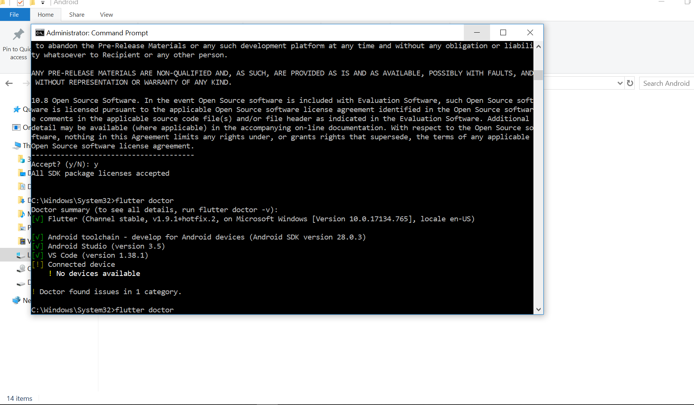

# Tutorial Install Flutter
NAMA : Calvin Shandika  
NIM : 20175520016  
Prodi : Teknik Informatika  
Kode Mata Kuliah : (COE-5109)   

LANGKAH-LANGKAH INSTALL FLUTTER:  
1.Siapkan Software FLUTTER beserta SDK  
2.Kemudian,download Command Line Tools Only pada  web Android Developer:  
https://developer.android.com/studio/#command-tools

3.Setelah filenya di download letakkan dalam satu folder yaitu Local Disk (C:\Android) dan setelah itu kita extract.Maka hasilnya akan ada 2 folder yaitu folder flutter dan tools.   
4.Selanjutnya silahkan download OpenJDK di halaman ini, dan pilih yang berekstensi zip. sesuaikan dengan sistem operasi yang digunakan, setelah di download jangan lupa untuk mengekstrak ke folder Android yang sudah kita punya sebelumnya dan rename nama folder dari jdk8u212-b03 menjadi openjdk. totalnya sekarang kita punya 3 folder yaitu flutter, tools dan openjdk.   
5.Setelah itu, kita harus menge-set Environment Variable dan Path, untuk windows silahkan buka command prompt dan ketikan command perbaris: 
•	setx JAVA_HOME “C:\Android\openjdk”  
•	setx ANDROID_HOME “C:\Android”  
•	setx ANDROID_SDK_ROOT “C:\Android\tools”   
•	setx path “%path%;”C:\Android\sdk;C:\Android\tools\bin;C:\Android\flutter\bin”  
 
6.Langkah selanjutnya adalah buka Command Prompt di C:/Android/tools/bin lalu jalankan beberapa perintah berikut:  
•	sdkmanager “system-images;android-28;default;x86_64”   
•	sdkmanager “platform-tools”   
•	sdkmanager “build-tools;28.0.3”   
•	sdkmanager “platforms;android-28”    
 
7.Setelah itu update sdk dengan command : sdkmanager —-update Jangan lupa untuk menjalankan syntax accept licenses nya flutter doctor --android-licenses   
8.Selanjutnya install Visual Studio Code dan ekstension flutter serta dart nya.   
9.Jika semuanya sudah selesai silahkan buka terminal (Command Prompt) di Android/flutter atau untuk pengguna windows bisa double klik di C:\Android\Flutter\flutter_console.bat dan jalankan perintah flutter doctor, maka hasilnya seperti gambar berikut.
   
10.Step terakhir adalah buat project di VsCode dengan klik F1 dan mengetikan Flutter: New Project setelah project selesai di load, klik F5 untuk mendeploy ke android device teman-teman.

